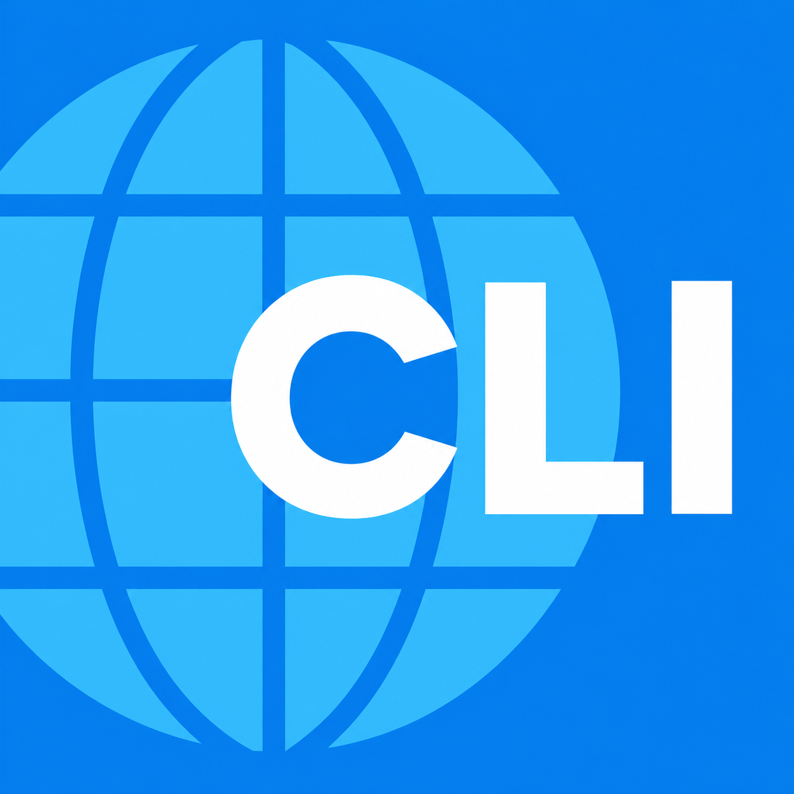

# Browser CLI

<p align="center">
  
</p>

Browser CLI 把你的 `终端` 带进浏览器。

使用浏览器管理你的所有Claude Code、Codex CLI对话。你可以使用浏览器原生能力对不同对话框进行分组。

【注意】请使用 **Chrome + Windows 11** 来体验本项目。其它平台（如MacOS）请使用 Tmux 等更好工具。

## 核心卖点

- 后台完成提醒
- 多会话像浏览器标签一样管理
- 关掉页面不丢进程

只要 Browser CLI 服务还在，终端会话会继续跑，回到管理页还能再接上。

## 功能

- 会话管理页：查看、进入、关闭当前运行中的终端会话
- 新建会话：通过系统文件夹选择器选择工作目录
- 完整终端：基于 `node-pty` 和 `xterm.js`
- 会话保留：关闭终端页面后，后端 PTY 会话继续运行
- 占用保护：同一个会话同一时间只允许一个浏览器 tab 连接
- 本机访问：默认只监听 `127.0.0.1`

## 技术栈

- 后端：Node.js、Express、WebSocket、node-pty
- 前端：Vite、TypeScript、xterm.js

## 安装

```powershell
npm install -g @qkunio/browser-cli
browser-cli
```

然后打开：

```text
http://127.0.0.1:3819
```

## 配置

默认端口是 `3819`，可以通过 `PORT` 覆盖：

```powershell
$env:PORT = "4000"
```

默认 shell：

- Windows：`powershell.exe`
- macOS/Linux：`$SHELL`，没有时使用 `/bin/bash`

可以通过 `SHELL_CMD` 覆盖：

```powershell
$env:SHELL_CMD = "pwsh.exe"
npm start
```

## 使用方式

1. 打开 `http://127.0.0.1:3819`
2. 点击“新建会话”
3. 在系统弹窗中选择一个文件夹
4. 应用会以该文件夹作为工作目录创建终端
5. 在终端中运行命令，例如：

```powershell
Get-Location
claude
```

返回管理页或关闭浏览器 tab 后，会话仍然保留。再次从管理页进入该会话即可继续使用。

## API

HTTP：

- `GET /`：管理页面
- `GET /sessions`：获取当前会话列表
- `POST /sessions`：打开系统目录选择器并创建新会话
- `DELETE /sessions/:id`：关闭并删除指定会话
- `GET /terminal/:id`：终端页面

WebSocket：

- `WS /sessions/:id/terminal`

客户端消息：

```json
{ "type": "input", "data": "..." }
```

```json
{ "type": "resize", "cols": 120, "rows": 32 }
```

服务端消息：

```json
{ "type": "output", "data": "..." }
```

```json
{ "type": "exit", "code": 0 }
```

## 关闭服务

如果你知道启动时的进程 ID：

```powershell
Stop-Process -Id <PID> -Force
```

也可以按端口查找并关闭：

```powershell
Get-NetTCPConnection -LocalPort 3819 |
  Select-Object -ExpandProperty OwningProcess |
  ForEach-Object { Stop-Process -Id $_ -Force }
```

## 当前限制

- 会话只保存在当前 Node.js 进程内，服务重启后会话会清空
- 不支持多人协作，也不支持远程认证访问
- 同一个会话同一时间只能被一个浏览器 tab 打开
- Linux 文件夹选择依赖 `zenity`
- macOS 文件夹选择依赖 `osascript`

## 验证

```powershell
npx tsc --noEmit
npm run build
```
